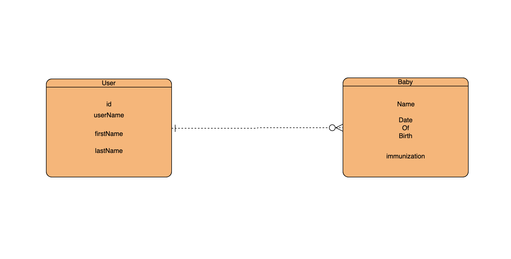

# babyTracker

# Team Members
- Jerome Joof
- Romell Pineda
- Sergey Voytov
- Martin Papa
- Dayne Daylong

# Project Description
- This app provides valuable information for users on the developmental milestones of babies in the first year after birth **(0-12) months**. We want to make it easier for the users by providing data based on statistics/research on where their baby should be. The app also has other features like nutrition which notifies users when to feed their babies or the last time their baby was fed, and also investing strategies for the users to better prepare for their baby’s future.

# Team Agreement

* Communication Plan
    * When you are going to be late, let the team know.
        * Slack
        * Phone numbers
        * Email
        * Text
* Conflict Plan
    * Majority vote (There are 5 people in the group so no need for a tie breaker)
    * We will try to resolve issue internally before we escalate.
    * If escalation is really needed, we will talk as a team.
* Work Plan
    * GitHub Project
    * Stand-Up in the morning and by end of day.
    * No work on the weekends.
    * Weekdays - 9 am to 5 pm.
* Git process
    * Development branch will be created.
    * Master is protected. 
        * 1 approver
* Create branch for every feature that we will implement.

# Database Entity-Relationship-Diagram

